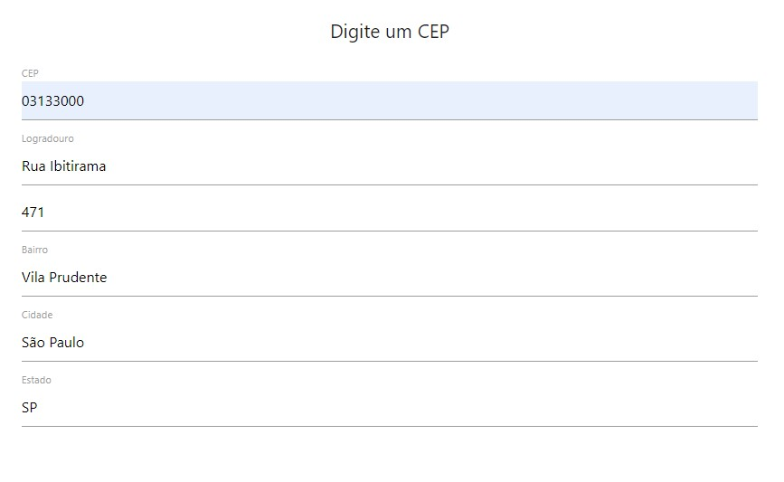

# CEP API

> CEP API é um código que faz uma requisição GET para uma API pública que fornece o endereço completo a partir do número do CEP digitado.

### Endereço da API
> CEP a baixo é apenas um exemplo.
<https://viacep.com.br/ws/03133000/json/>

### Tecnologias utilizadas

* HTML
* CSS
* JS
* Promise
* Fetch API
* DOM API
